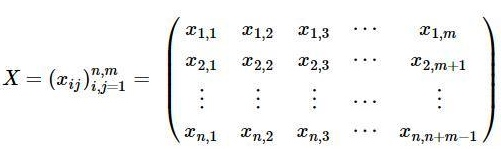
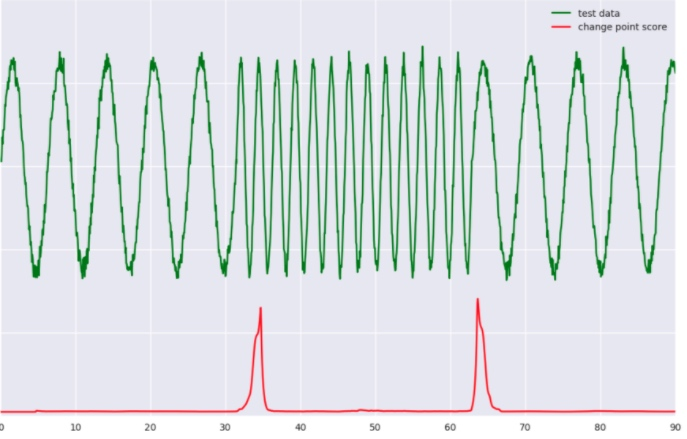

# tool-时间序列-banpei

时间序列工具 
https://github.com/chickenbestlover/RNN-Time-series-Anomaly-Detection
https://github.com/rob-med/awesome-TS-anomaly-detection


工具汇总


| 工具 | 方法 | 备注 |
| --- | --- | --- |
| banpei | Outlier detection (Hotelling's theory) 均值+方差 Change point detection （sst奇异谱转换） | 主要就是这两种方法 |
| adtk | rule based |  |
|  |  |  |


## ADTK
https://github.com/arundo/adtk. adtk主要是 unsupervised / rule-based time series anomaly detection.

教程 https://arundo-adtk.readthedocs-hosted.com/en/stable/userguide.html。

adtk提供了很多检测的方法，但是不会自动选择，得需要指定那个。具体的

(1) 数据徒增


## banpei SSA: 奇异谱分析
python package `fastsst`
https://github.com/statefb/singular-spectrum-transformation

SSA是一种研究非线性时间拿序列的方法，他根据观测到的序列构造出一个轨迹矩阵，然后通过对轨迹矩阵分解、重构，从而提取出能代表原始时间序列不同成分的信号。具体地，主要包括如下几步:
（1）嵌入
假设原始的时间序列是 $Y(T) = (y_1, y_2,... y_T)$,选择一个窗口m，根据原始序列构造如下的轨迹矩阵。m的选择不宜过大，可以是本身数据周期的整数倍。


(2)svd分解

$$X = U\Sigma V^T$$

(3)分组
选择贡献率达到一定阈值的top r个
(4)重构
矩阵重构 $$X_{mxn}  \approx U_{m*r}\Sigma_{r*r} V^T_{r*n}$$
原序列重构, 通过对角平均法的方式



m 窗口的选择，较小m反应短期趋势，较大的就是长期趋势。
变点发现
```
```





