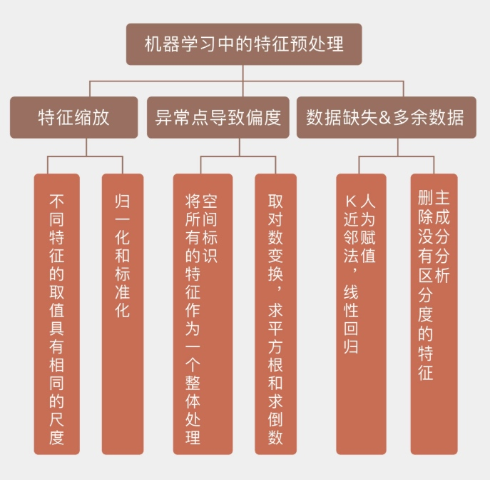

# 二、起步篇——数据预处理[方法论]

## 1.数据偏度

数据的处理，从数据特征本身的统计维度看，有尺度、偏度、

1.数据尺度

* 标准化 => 均值0，方差1
* 归一化 => [0,1]

2.数据偏度
可以通过偏度来度量，数据中如果存在较大的偏度，可能是因为有异常点的存在。

有偏数据处理，一般可以取log，或者开根号让他能近似正态

## 2.异常点

首先什么是异常点
异常点
（1） 首先确认是不是错误导致，比如计算错误。取值错误
（2）确认异常点的生成机制

（1）异常点检测

@@@
sklearn中常用的包

（2）异常点处理

* 如果是少量可以直接删除
* 当数据量较少，删除后造成可用信息较少时候，可以使用“空间标识”的数值处理方法

## 3.缺失值

缺失机制：随机缺失，还是非随机缺失

补充原则：

* 如果缺失占比太大，删除

补充方法：

* 统计方法：均值
* 机器学习方法：回归、K近邻

## 4.特征冗余

一般是说特征自相关性太高，即“共线性”。另外是指一些没有区分度的变量，比如一是特征取值的总数与样本数目的比例在 10% 以下，二是出现频率最高的特征取值的出现频率应该在出现频率次高的特征的20倍以上。

检测办法：
解决办法：PCA

## 参考文章

离群点

https://blog.chih.me/Outlier-mining-review.html

